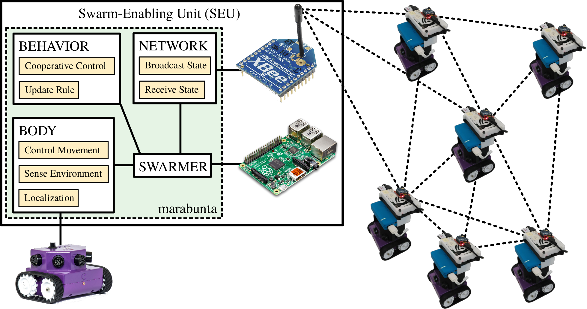

# marabunta
A Python library for the design and control of artificial swarms.

## Overview
This package includes tools to either control or simulate specific hardware parts of a robot capable of _(i)_ locomotion, _(ii)_ sensing, and _(iii)_ communication with the aim of performing experimental research in artificial swarming. It also includes some models of swarming behavior built using these tools.
For more information see <http://journal.frontiersin.org/article/10.3389/frobt.2017.00012/>

The design of robots using this library consists of three main pieces:

1.  The body the robot uses to move and sense the environment.
2.  The network the robot uses to communicate with other robots.
3.  The behavior or protocol the robot follows, i.e. what it does with the information received from the body and the network.




The marabunta library follows this structure and provides the following classes:

*   **BaseBody**: [[marabunta/BaseRobot.py]](marabunta/BaseRobot.py) Minimal model of `Body` with the required methods to use as a body of a robot. Any body models should inherit from this class to be accepted by `BaseRobot`.
    *   **MockBody**:[[marabunta/MockBody.py]](marabunta/MockBody.py) `Body` implementation to simulate a robot body. Does not require any hardware to use. A file with a list of coordinates can be loaded to include obstacles in the simulation.
    *   **eBotBody**:[[marabunta/eBotBody.py]](marabunta/eBotBody.py) `Body` implementation to control an [eBot](http://edgebotix.com/). Requires bluetooth connection, an eBot, and the appropiate eBot-API installed.
*   **BaseNetwork**: [[marabunta/BaseRobot.py]](marabunta/BaseRobot.py) Minimal model of `Network` with the required methods to use as a network of a robot. Any network models should inherit from this class to be accepted by BaseRobot.
    *   **MockNetwork**: [[marabunta/MockNetwork.py]](marabunta/MockNetwork.py) `Network` implementation to simulate the communication using regular files (assumes the different robots are in the same computer, or at least can access the same files). Does not require any hardware to use.
    *   **XBeeNetwork**: [[marabunta/XBeeNetwork.py]](marabunta/XBeeNetwork.py) `Network` implementation using a series 1 XBee. Requires an XBee connected through a serial port.
*   **BaseRobot:** [[marabunta/BaseRobot.py]](marabunta/BaseRobot.py) Contains the basic tools to operate a robot. It requires a _body_ instance that inherits from `BaseBody` and a _network_ instance that inherits from `BaseNetwork`.
    *   **HeadingConsensusRobot**: [[marabunta/models/HeadingConsensusRobot.py]](marabunta/models/HeadingConsensusRobot.py) Implementation of a robot following a heading consensus algorithm. Aligns its heading to the average heading of the swarm, i.e. it follows
    *   **PerimeterDefenseRobot**: [[marabunta/models/PerimenterDefenseRobot.py]](marabunta/models/PerimenterDefenseRobot.py) Implementation of a robot performing perimeter defense. It moves away as far as possible from other robots. If the _body_ provides a way to detect light, this behavior will stop when an intense light is detected and broadcast a rendezvouz signal to the swarm.
    *   **MarchingRobot**: [[marabunta/models/MarchingRobot.py]](marabunta/models/MarchingRobot.py) Implementation of a robot marching in formation. It simulataneously tries to keep a safe distance with the closests robot, keep close enough to the rest of the swarm, and keep its heading aligned to the swarm heading.
*   **Map2D**: [[marabunta/Map.py]](marabunta/Map.py) Object to store and access map data to simulate the obstacle detection in `MockBody`. The obstacles are loaded from a file and stored in a grid using "Verlet lists" for fast access to local obstacle data.

## Installation
To install the module, type:
```Bash
python setup.py install
```
(may require `sudo` depending on your system). This will install the `marabunta` module and its
`marabunta.models` submodule.

### eBot API
To control eBots through `eBotBody` one needs to have the eBot-API installed. The official version can be found at <https://github.com/EdgeBotix/eBot-API>.
A fork of this API that uses the host CPU to compute the localization of the robot by implementing a Kalman filter instead of relying on the eBot localization can be found at <https://github.com/david-mateo/eBot-API>.

## Using this library

To design a robot behavior, one should define a new class that inherits from `BaseRobot`. The initialization of `BaseRobot` requires of a body, implemented as a class inheriting from `BaseBody`, and a network, a class inheriting from `BaseNetwork`.

To add support for new hardware, one should implement classes inheriting from `BaseBody` or `BaseNetwork`. These classes contain the minimal list of methods than any body or network should implement.

To use the provided methods to make the robot move following a particular behavior, say heading consensus, one has to define the body, the network, the robot, turn it on, and iteratively call its `update` method. A minimal example code is:
```python
from marabunta import eBotBody, XBeeNetwork
from marabunta.models import HeadingConsensusRobot

total_time = 60
ID = "Walle"
init_pos = [0., 0.]
init_heading = 0.
communication_slot = 0.1
body = ebotBody( init_pos , init_heading)
network = XBeeNetwork(communication_slot, communication_slot + 0.1, 1, ID)
robot = HeadingConsensusRobot(body, network)
robot.turn_on()

# MAIN LOOP
end_time = time() + total_time
while time() < end_time:
    robot.update(dt, speed)
    sleep(dt)

robot.turn_off()
```
Any robot inherting from `BaseRobot` has `__enter__` and `__exit__` methods that allow to use the robot with the `with` statement instead of explicitly turning it on and off. This option provides a cleaner way to operate the robot in the face of potential hardware failures.
A minimal example code following this approach is:
```python
from marabunta import eBotBody, XBeeNetwork
from marabunta.models import HeadingConsensusRobot

total_time = 60
ID = "Walle"
init_pos = [0., 0.]
init_heading = 0.
communication_slot = 0.1
body = ebotBody(init_pos, init_heading)
network = XBeeNetwork(communication_slot, communication_slot + 0.1, 1, ID)

with HeadingConsensusRobot(body, network) as robot:
    # MAIN LOOP
    end_time = time() + total_time
    while time() < end_time:
        robot.update(dt, speed)
        sleep(dt)
```

One can find several ways to operate the robots in the scripts contained in [`examples/`](examples/).


## References

*   Swarm-Enabling Technology for Multi-Robot Systems. <http://journal.frontiersin.org/article/10.3389/frobt.2017.00012/>
